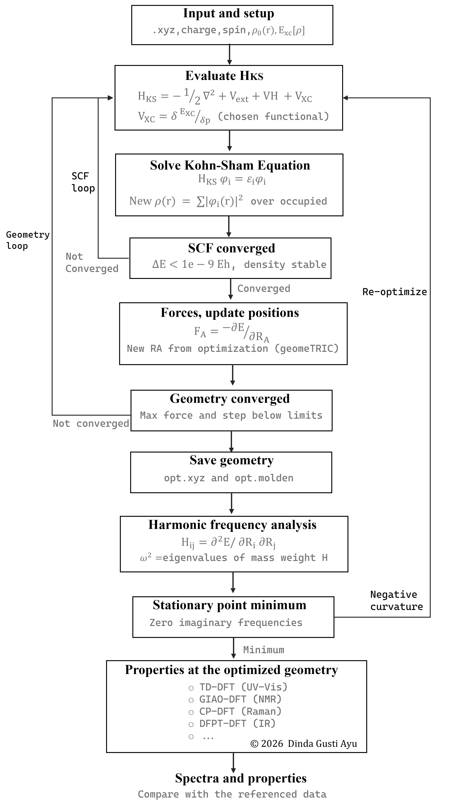

# DFT-toolkit

Welcome to the [__DFT-toolkit__]()!

This repository contains the algorithm experimentation for DFT calculation with open-source python package to learn, and verify from reported results in recent or past publications.

## Getting started

1. To install DFT-toolkit from source, clone this repository from [github](https://github.com/dindagustiayu):
   
```bash
git clone https://github.com/dindagustiayu/DFT-toolkit.git

```

2. You can explore the GitHub-Colab for tutorials, and the folders for example inputs, outputs and suppelementary reference.
3. Follow the example code and adapt them to your own data.

## Scope

THe following chemical properties are recalculated and compared with the published data:

- Molecular structure: geometry optimization, bond lengths, angles and dihedrals.
- Vibrational properties: harmoniq frequencies, IR Sprectra, and zero-point energy.
- Transition energies: electronic excitation energies and UV-Vis spectra using TD-DFT.

## Computational details

- Software: [VASP](https://vasp.at/info/about/), [QuantumESPRESSO](https://www.quantum-espresso.org/), [abinit](https://www.abinit.org/), [Gaussian](https://gaussian.com/), [PySCF](https://pyscf.org/), [Psi4](https://psicode.org/), and [geomeTRIC](https://geometric.readthedocs.io/).
- Functionals: LDA (BLYP), GGA (M06L), hybrid GGA (B3LYP).
- Basis Sets: STO-3G, 3-21G, 4-31G, 6-31G, 6311G, aug-cc-p-V6Z
- Solvation model: PCM, COSMO.

## Workflow

The workflow is following the steps in this illustration.

<div align='center'>
    
</div>


## Contribution

Suggestions, issues, and pull request are welcome. If you find an error or have an idea, feel free to open an issue. 

## Contact

Email me at[materials@dindagustiayu.com](mailto:materials@dindagustiayu.com)

## License

CC BY-NC 2026 Dinda Gusti Ayu


